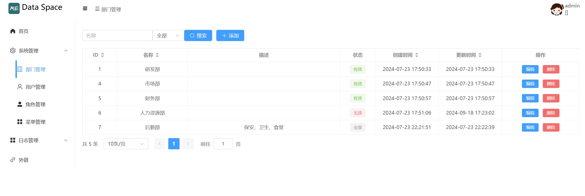
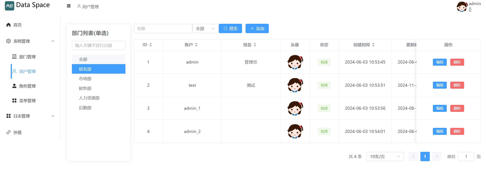
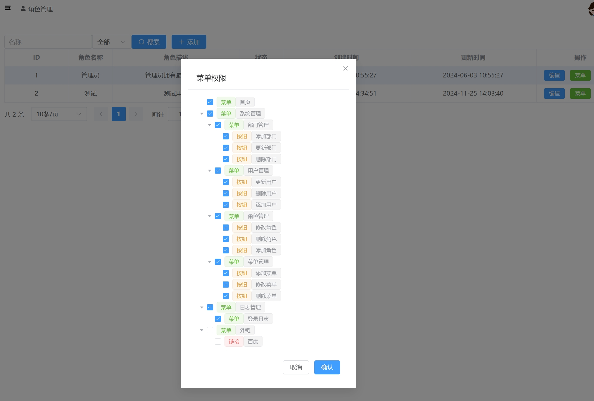
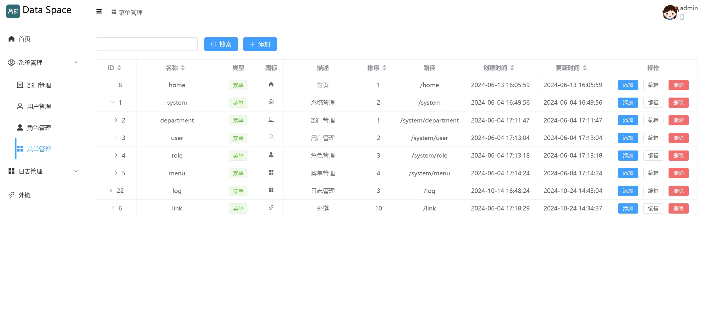
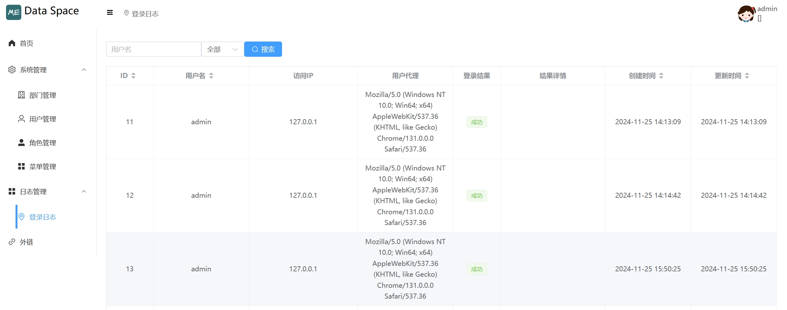
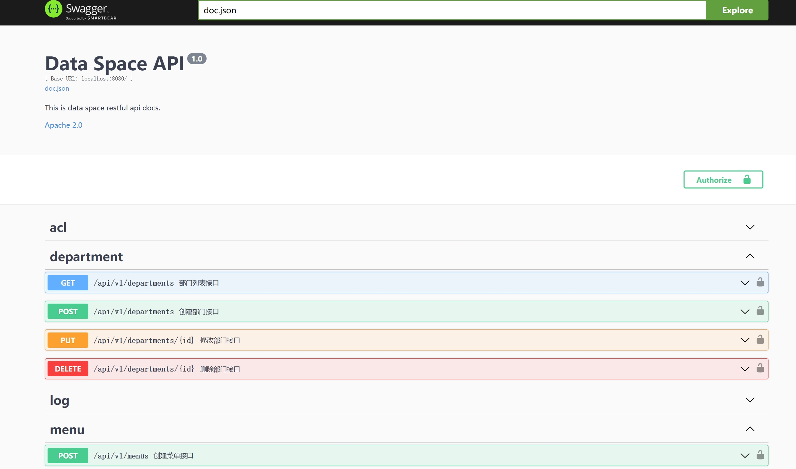

# data-space

通用的后台管理系统

## 功能

- 用户登录和日志
- 部门管理
- 用户管理
- 角色管理
- 菜单管理

## 🛠 技术栈

### 前端

- vue3
- vite
- pina
- element-plus

### 后端

- go
- mysql
- gin
- opentelemetry
- prometheus metric

## 安装

### 前端

```bash
  cd frontend
  npm install
```

### 后端

```bash
  cd backend
  go mod tidy
```
    
## 本地运行

### 前端

```bash
  cd frontend
  npm run dev
```

### 后端

```bash
  cd backend
  go run cmd/root.go
```


## 截图













## 收藏历史

[](https://star-history.com/#hexiaopi/data-space&Date)


## 许可证

[MIT](https://choosealicense.com/licenses/mit/)

